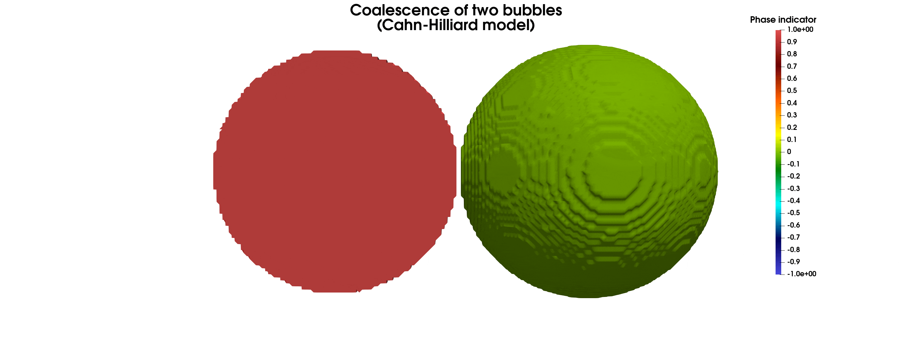
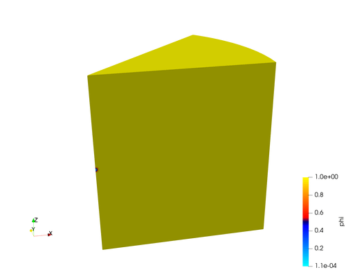
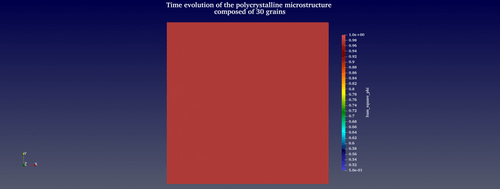
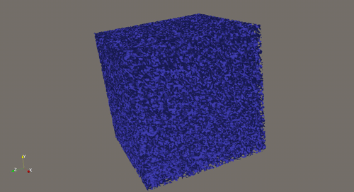
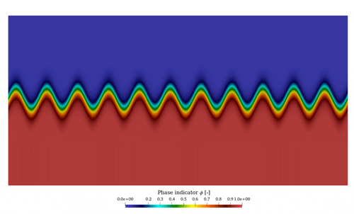
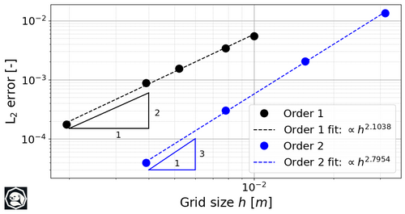
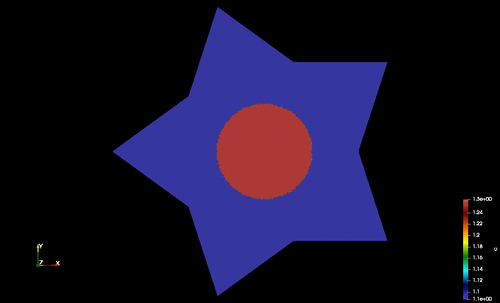

# Gallery
Hall of Fame of simulations performed with SLOTH

## Coalescence of two bubbles

This simulation is adapted from a case published in  [L.Bu, et al., Comp. and Math. With Appl. 78(2019)3485–3500](https://doi.org/10.1016/j.camwa.2019.05.016). 

The initial condition consists of two bubbles that coalesce over time.

This 3D  simulation is run with $32$ million DOF over $4096$ MPI processes on Topaze supercomputer at CEA.

## Incipient melting in a pellet fragment under an ad-hoc temperature dependent enthalpy of melting

This test has been performed in order to challenge the code over a huge number of degrees of freedom (DOF). 
Indeed, this 3D  simulation is run with $1.2$ billion DOF over 
$32768$ MPI processes on Topaze supercomputer at CEA

## Time evolution of a polycristalline microstructure with 30 grains

This simulation is based on a case published in  [Biner et al., (2017), Springer International Publishing](https://link.springer.com/book/10.1007/978-3-319-41196-5). 

The polycristalline microstructure is composed of 30 grains (instead of 25 in Biner's book). 

Regarding the numerical scheme, each Allen-Cahn equation is solved using an implicit scheme, except for the interaction term between each grain where a semi-implicit scheme is considered.

## Spinodal Decomposition

This case is based on the work published in [J. Shin et al., (2014), App. Math. & Comp. 244, 606-612](https://www.sciencedirect.com/science/article/pii/S0096300314009977). 
Their 2D case has been extended in 3D with more than $132$ million DOF. 

The simulation has been performed with $2048$ MPI processes on Topaze supercomputer at CEA.

## Manufactured Allen-Cahn Solution

This case is taken from the [NIST PFHub repository](https://pages.nist.gov/pfhub/). 

It corresponds to a manufactured Allen-Cahn solution problem.

### Results of the convergence analysis (in space)

## 2D non linear time-dependent diffusion

This case is taken from the [MFEM website](https://mfem.org/). 
It correspond to the [example 16](https://mfem.org/examples/) but here extended to an implicit non linear resolution. 

